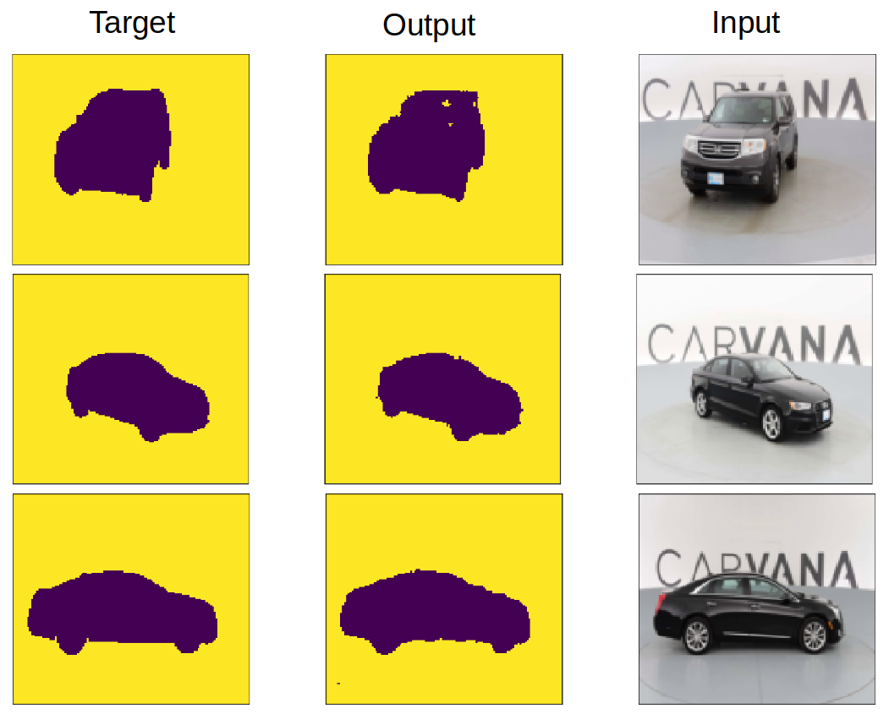

# UNET
My UNET pytorch code for training and Inference for car image segmentation
## Network architecture
  - I used original U-Net paper for the basic architecture and slightly modified input size to remove cropping because my data does not touch boundary
  - see original paper [U-Net: Convolutional Networks for Biomedical Image Segmentation](https://arxiv.org/abs/1505.04597)
## contenst
  - training jupyter notebook use: Train.ipynb
  - inference jupyter notebook use : Inference.ipynb
  - training data 
    - I used Kaggle Carvana car segmentation data set for traning network. Need to add original input image inside datas/train folder and segmentation image into datas/train_mask for full training
    - see [Kaggle carvana data set](https://www.kaggle.com/c/carvana-image-masking-challenge/data)
  - sample data
    - I made datas/train and datas/train_mask sample folder and put few images from Kaggle Carvana data set
  - pre trained model file: sim_unet_final.pth
## output example  
  
